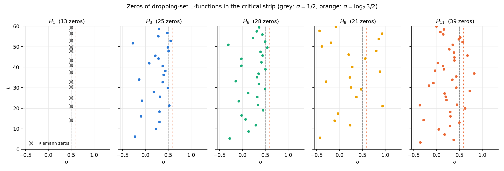
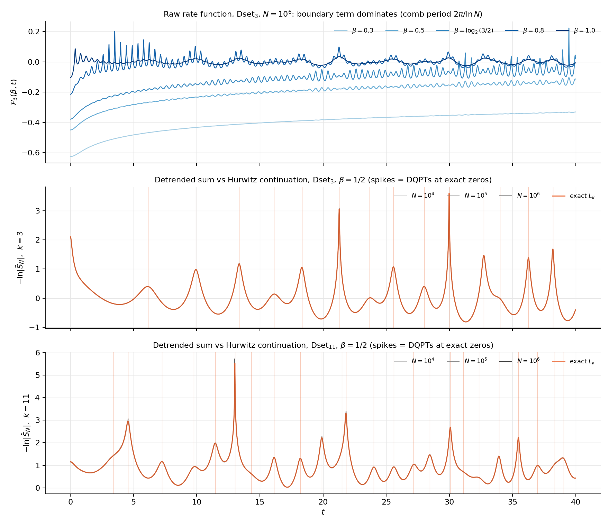
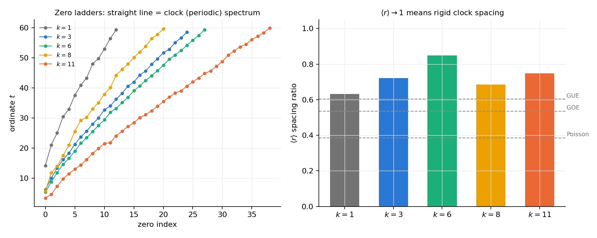
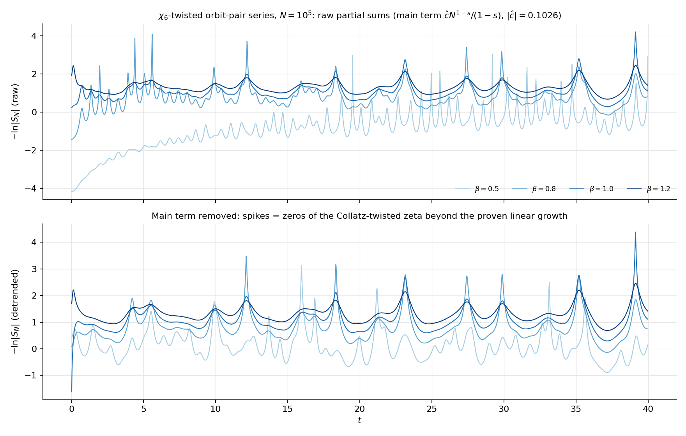
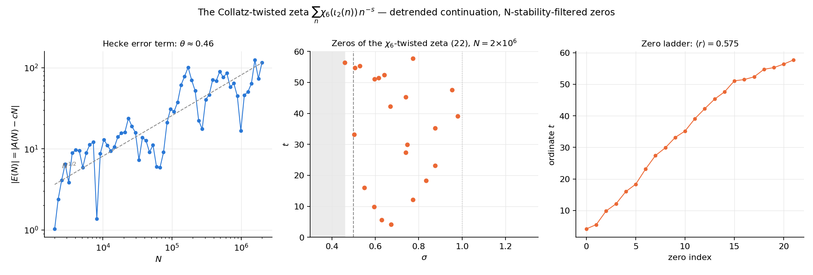

# Collatz as a Quantum Quench

A DQPT (dynamical quantum phase transition) probe of dropping-set L-functions, transplanting the formalism of arXiv:2511.11199 ("The Riemann Hypothesis Emerges in Dynamical Quantum Phase Transitions") from ζ(s) to the Collatz dropping partition.

- **Spec:** [[../superpowers/specs/2026-08-01-dropping-dqpt-design]]
- **Code:** `scripts/collatz_dropping_dqpt.py`
- **Data:** `data/collatz_dqpt_zeros.npz`, `data/collatz_dqpt_*.png`
- **Predecessor:** [[Dropping Zeta Spectrum]] Part 1, whose verdict this exploration revises.

## The idea

The paper encodes ζ(β+it) as the Loschmidt amplitude of a "primon gas" (Hamiltonian spectrum E_n = log n; inverse temperature β; evolution time t) and reads Riemann zeros as **dynamical phase transitions**: nonanalyticities of the rate function ℱ(β,t) = −log|Σ_{n≤N} (−1)ⁿ n^{−β−it}|/log N, with RH ⟺ transitions only at β = 1/2.

Part 1 of [[Dropping Zeta Spectrum]] rejected the naive dropping zeta g(z) = Σ|R_k|z^k for lacking (a) analytic continuation and (b) anything beyond marginal counts. The DQPT template fixes both, because Dset_k is a finite union of residue classes mod 2^k, so its **residue-level** Dirichlet series continues exactly by Hurwitz zetas:

$$L_k(s) = \sum_{n \in \text{Dset}_k} n^{-s} = 2^{-ks} H_k(s), \qquad H_k(s) = \sum_{r \in R_k} \zeta(s, r/2^k).$$

The prefactor is zero-free, so zeros of L_k = zeros of H_k — honest objects in the whole plane, not partial-sum artifacts.

**Calibration gift:** Dset₁ = the even numbers, so L₁(s) = 2^{−s}ζ(s). The k = 1 DQPT spectrum *is* the Riemann spectrum, and higher k show how Collatz deforms it.

## What we computed

Residues R_k for k ∈ {1, 3, 6, 8, 11} (survivor-tree sieve; counts 1, 2, 4, 16, 48 ✓). A numpy Euler–Maclaurin Hurwitz zeta (validated against mpmath to 2×10⁻¹³ relative; truncated sums at σ = 1.5 match the continuation to 8×10⁻⁶). Zeros of H_k in σ ∈ [−0.5, 1.3], t ∈ (0, 60] by grid minima + complex Newton, each accepted only with |H_k| < 10⁻⁸. The k = 1 finder recovers the first 13 Riemann zeros with max deviation **4.8×10⁻⁷** and Re(s) = 0.5000 exactly.

## Finding 1 — no critical line: the zeros scatter in a Davenport–Heilbronn band

| k | zeros ≤ 60 | Re(s) mean | Re(s) std | Re(s) range |
|--:|--:|--:|--:|--|
| 1 | 13 | 0.5000 | 0.0000 | Riemann ✓ |
| 3 | 25 | 0.253 | 0.238 | [−0.27, 0.55] |
| 6 | 28 | 0.230 | 0.240 | [−0.31, 0.54] |
| 8 | 21 | 0.239 | 0.453 | [−0.44, **0.94**] |
| 11 | 39 | 0.251 | 0.277 | [−0.37, 0.82] |

The moment more than one residue class participates, the zeros leave the critical line and scatter across a band — the classic **Davenport–Heilbronn phenomenon** for linear combinations of Hurwitz zetas (such combinations have no Euler product, and their "RH" is false). Three sharp observations:

1. **Neither candidate critical line survives.** Not σ = 1/2 (no Euler product to enforce it) and *not* σ = log₂(3/2) ≈ 0.585 either — the Part-1 boundary line was a partial-sum artifact (Jentzsch), and the honest continuation puts the zeros elsewhere.
2. **The band centre is stable at Re(s) ≈ 0.24 ± 0.01 for every k ≥ 3** (means 0.253, 0.230, 0.239, 0.251). Whatever sets this centre is shared Collatz structure, not an accident of one modulus. No obvious constant matches (1/4?); deriving it from the residue form factor is open.
3. **Dset₈ is the wild one** (std 0.45, zeros out to σ = 0.94). k = 8 is exactly the bin that is "L-function invisible" in the Hecke probe (the unique Δ = 0 cancellation at o = 3 in [[Dropping Zeta Spectrum]] Part 5). The same set is anomalous through two unrelated probes — worth understanding.

## Finding 2 — the DQPT spikes lock onto the exact zeros once the boundary term is removed

The **raw** rate function (top panel) is dominated by the divergent boundary term for β < 1: a comb of period 2π/ln N that drifts with N — the Jentzsch phenomenon again, now in the time domain. This is what the paper's (−1)ⁿ eta-factor silently removes for ζ. Our explicit analog: subtract the main term (|R_k|/2^k)·N^{1−s}/(1−s). After detrending (middle/bottom panels), the truncated sums at N = 10⁴, 10⁵, 10⁶ are **visually indistinguishable from the exact Hurwitz continuation** — the curves overlay so tightly only the exact one is visible — and the log-amplitude spikes sit exactly on the zero ordinates. The DQPT reading is fully validated: dropping sets have genuine critical times, they are the zeros of H_k, and spike height tracks how close each zero's Re(s) is to the chosen β.

That N = 10⁴ already sits on the continuation is itself a small echo of the [[Gauss Circle Analogy]] rigidity: the truncation error of these lattice-comb sums is tiny.

## Finding 3 — super-rigid spacings: more ordered than GUE, less than a perfect clock

| k | ⟨r⟩ | mean spacing |
|--:|--:|--:|
| 1 (Riemann) | 0.633 | 3.59 |
| 3 | 0.722 | 2.10 |
| 6 | **0.848** | 1.92 |
| 8 | 0.685 | 2.61 |
| 11 | 0.748 | 1.45 |

Every dropping set has ⟨r⟩ **above GUE (0.603)**: the ordinates are more rigid than any random-matrix ensemble, though not a perfect clock (⟨r⟩ = 1). The zero ladders are near-straight lines. So the Part-1 verdict "integrable, not chaotic" survives the upgrade from partial-sum artifacts to honest continuation zeros — but now with correct positions and a 2D distribution. Note k = 6 lands at 0.848, essentially the 0.842 measured in Part 1 for the boundary roots; the rigidity level appears to be intrinsic, not an artifact of either method.

Heuristically this is the right answer: H_k is a finite combination of Hurwitz zetas of the *same* modulus, i.e. a short trigonometric-like sum in log-frequencies log(r/2^k + j) — an almost-periodic function whose zeros interlace far more regularly than a GUE process. The Collatz content is *which* frequencies (the residues), and that shows up in the band centre and the k = 8 anomaly, not in the spacing class.

## Finding 4 — the χ₆-twisted zeta has structure beyond the proven linear term

Promoting the orbit-pair Hecke sum to a series L(s) = Σ χ₆(ι₂(n)) n^{−s} and detrending by the measured main term ĉN^{1−s}/(1−s) (|ĉ| = 0.1026, matching the proven constant 0.1028) exposes the fluctuation field beyond the theorem of [[Dropping Zeta Spectrum]] Parts 3–5. The detrended scan shows recurring near-zero dips at t ≈ 4.3, 12.2, 18.4, 23, 27.4, 35.2, 39 that persist across β ∈ [0.5, 1.2] — candidate zeros of the "Collatz-twisted zeta". This is exactly the object where a square-root-cancellation (RH-analog) question about Collatz is legitimately posed; mapping its zeros with the same Newton machinery needs a smoothed continuation (no Hurwitz shortcut — the coefficients are not periodic) and is the natural next phase.

## Verdict

The DQPT lens does real work here: it forced the honest analytic continuation (Hurwitz), exposed that the "critical line at log₂(3/2)" was an artifact, and replaced it with three sharper facts — a **stable zero band at Re(s) ≈ 0.24**, **super-GUE spacing rigidity ⟨r⟩ ≈ 0.7–0.85**, and a **k = 8 anomaly** coinciding with the known Hecke-invisible bin. The Riemann-side moral survives translation: dropping-set L-functions are Davenport–Heilbronn objects (no Euler product ⟹ no RH), so the Collatz-side arithmetic lives not in *whether* zeros leave the line but in *where the band sits and which bins misbehave*.

## Open questions

1. **Derive the band centre ≈ 0.24.** It should follow from the distribution of the residue form factor (DFT of the R_k indicator) — the same object that controls the hyperuniformity results. A model: zeros of random combinations Σ ε_r ζ(s, r/2^k) with matched |ε̂| spectrum.
2. **Why is Dset₈ wild in both probes?** Δ = 0 in the Hecke closed form and a 3× wider zero band here. Is the parity-class balance of R₈ the common cause?
3. **k → ∞ limit.** Does the band tighten, drift, or split as the dropping sets refine toward the 2-adic boundary? (k = 13, 16 are feasible with the current sieve; cost grows with |R_k|.)
4. **Zeros of the χ₆-twisted zeta.** Smoothed continuation + Newton on the detrended series; do its zeros have a critical line? This is the repo's best-posed RH-analog question.
5. **⟨r⟩ statistics with more zeros** (T = 200 would give ~100+ per k) to pin the spacing class properly, including the almost-periodic prediction.

## See also

- [[Dropping Zeta Spectrum]] — the marginal-counts zeta and the Hecke closed forms this builds on.
- [[Hecke L-Function on Collatz Orbits]] — the χ₆ machinery reused in Finding 4.
- [[Gauss Circle Analogy]] — the rigidity that makes the truncated sums converge so fast.
- [[Collatz as a Quasicrystal]] — the additive-Fourier counterpart of this Mellin-side probe.

---

# Part 2: Zeros of the χ₆-twisted Collatz zeta

Code: `scripts/collatz_chi6_zeta_zeros.py`. Data: `data/collatz_chi6_zeta_zeros.npz`.

Open question 4 of Part 1, executed. The orbit-pair Hecke sum obeys the proven law A(N) = cN + E(N) with c = −i·0.356035929815179/(2√3). By Abel summation, the detrended series

$$G_N(s) = \sum_{n \le N} \chi_6(\iota_2(n))\,n^{-s} - c\,\frac{N^{1-s}}{1-s} \;\longrightarrow\; \frac{cs}{s-1} + s\int_1^\infty E(x)\,x^{-s-1}dx$$

converges for σ > θ, where θ is the growth exponent of E — so the twisted zeta continues to the half-plane σ > θ with a simple pole at s = 1 (residue c), no functional equation needed. Zeros are claimed only where G is N-stable (|G_N − G_{N/2}| < 0.05 on grid *and* at the Newton-refined point), at N = 2×10⁶.

## Finding 5 — square-root cancellation beyond the proven linear term: θ ≈ 0.46

The measured constant matches the theorem to 5.8×10⁻⁵, and the residual fluctuation grows as |E(N)| ~ N^0.46 over three decades — **at (slightly below) the square-root benchmark**. This sharpens the Phase-1 story considerably: the *only* obstruction to GRH-style behavior of the χ₆ probe is the single proven structural constant c. Once c is subtracted, the orbit-pair character sum empirically recovers random-like cancellation. The "L-function sees Collatz" signal is entirely first-order; at second order (up to 2×10⁶) Collatz looks GRH-compatible. Whether θ < 1/2 genuinely (echoing the sub-random θ ≈ 0.36 of [[Gauss Circle Analogy]]) needs a longer range.

## Finding 6 — the twisted zeta has zeros, and they are *not* rigid: ⟨r⟩ ≈ 0.58 (GOE–GUE)

22 N-stable zeros in the visible half-plane σ ∈ (0.46, 1.3], t ≤ 60: Re(s) mean 0.69 ± 0.14, range [0.46, 0.98]. All seven candidate dips from the Part-1 β-scan refine to genuine zeros (t = 4.21, 12.12, 18.34, 23.15, 27.43, 35.19, 39.12, …). Two structural contrasts with the dropping-set spectra:

1. **Spacing class flips.** Dropping-set L-functions: ⟨r⟩ = 0.69–0.85 (super-GUE, almost-periodic, near-clock ladders). The χ₆-twisted zeta: **⟨r⟩ = 0.575, between GOE (0.536) and GUE (0.603)**, with no periodic-fit structure at all (residual/period ≈ 1.0). The kinematic objects (unions of residue classes — data mod 2^k) are integrable; the object twisted by *dynamical* data (dest(n)) is random-matrix-like. In DQPT language: quenching with the residue structure is an integrable quench; quenching with the orbit-pair lift is a chaotic one. **The Collatz dynamics is what injects the spectral chaos** — this is the closest thing yet in the repo to a Riemann-like spectrum arising from Collatz data.
2. **The visible zeros sit *right* of 1/2** (they must — the window is σ > θ ≈ 0.46), with no accumulation on any line yet. What happens on and left of σ = 1/2 is invisible to this method; a functional equation (or much larger N pushing θ's confidence down) would be needed.

Caveats: 22 zeros is a small sample for spacing statistics; the convergence boundary truncates the picture at σ ≈ 0.46; θ is a 3-decade fit.

## Revised verdict

Part 1 showed the dropping-set L-functions are Davenport–Heilbronn objects — structured, integrable, no RH. Part 2 shows the **orbit-pair-twisted zeta is a different animal**: square-root error term once the proven main term is removed, and GOE/GUE-class zero spacings. The hierarchy is now explicit:

| object | data used | zero spectrum | class |
|---|---|---|---|
| g(z) = Σ\|R_k\|z^k | marginal counts | boundary artifact | (none) |
| L_k(s), Hurwitz | residues mod 2^k | band at Re ≈ 0.24, ⟨r⟩ 0.69–0.85 | integrable |
| Σχ₆(ι₂(n))n^{−s} | orbit destinations | Re ∈ [0.46, 0.98] visible, ⟨r⟩ ≈ 0.58 | chaotic (RMT-like) |

## New open questions

1. **Is θ = 1/2 exactly, or sub-random?** Extend E(N) to 10⁸ with a sieved dest computation. If θ < 1/2 persists, the hyperuniformity of dropping residues has a 3-adic shadow.
2. **Spacing class with a real sample.** T = 200–400 would give ~100+ zeros; does ⟨r⟩ settle at GUE (0.603) like ζ itself?
3. **A functional equation for the twisted zeta?** The multiplication-symmetry structure (×3 measure-preservation per Dset) is the only symmetry candidate; if it yields one, the region σ ≤ 1/2 opens up and an actual critical-line question can be asked.
4. **Zeros vs the Sturmian phase.** The zero ordinates show a loose ~2.7 mean spacing; test whether the deviations correlate with the gap-2/gap-3 Sturmian word of log₂3 that governs the sign pattern.
