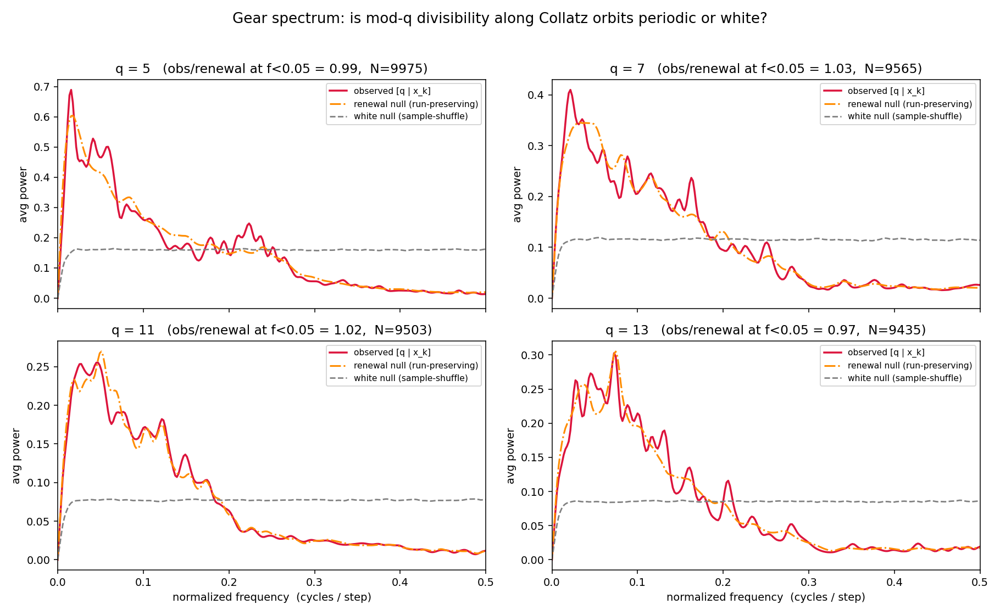
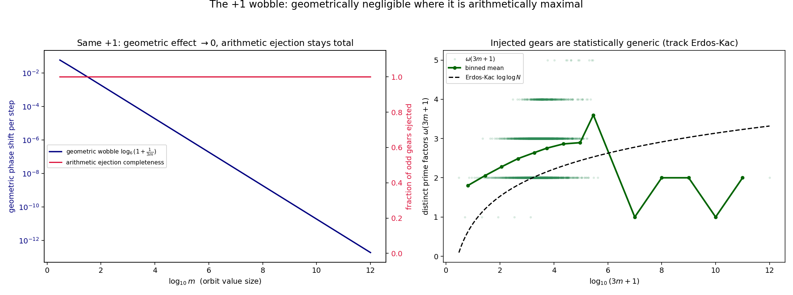

# Gear Spectrum and the +1 Wobble Channels

**Premise.** Strip the `+1` and Collatz is purely multiplicative: `m → 3m →
3m/2^a`, so every orbit value would be `3^i/2^j · n`, its prime factors locked
to `{2,3} ∪ factors(n)` forever, and its `log₆` phase a rigid rotation by
`α = log₆ 3`. The **`+1` (the "wobble")** breaks that closure — but it acts in
three channels at once, and they behave completely differently:

| Channel | What `+1` does | Size-behavior |
|---|---|---|
| **Geometric** (phase) | shifts `log₆ x` by `log₆(1 + 1/3m)` | **vanishes** as `1/m` |
| **Arithmetic** (factor gears) | total coprimality reset: ejects every odd gear | **total** at every size |
| **Modular / spectral** (mod `q`) | turns `×3` into the affine `3m+1` mod `q` | burst-shaped, **renewal** |

Two probes pin down the second and third channels. (The first is the
[[Collatz as a Quasicrystal]] note.)

---

## Probe 1 — Gear spectrum: periodic, white, or red?

**Question.** Along an orbit, is mod-`q` divisibility `s_k = [q \mid x_k]`
*periodic* (a gear tone), *white* (Collatz mixing), or something else?

**Method** (`scripts/collatz_gear_spectrum.py`). Ensemble-averaged periodogram
of `s_k` over ~9,500 orbits (odd seeds in `[5001, 25001)`), full orbit to 1 —
the trailing powers-of-2 ramp is all zeros for odd `q`, so no artifact. Two
nulls:
- **white** (sample-shuffle): destroys all time structure → flat floor.
- **renewal** (run-preserving): keeps each orbit's burst-width and gap-width
  multisets, shuffles run order → destroys serial correlation while preserving
  burst shape. The decisive test for clustering *beyond* burst structure.

**Result.**
- **Not white.** Observed power rises ~3.4–4.4× above the white floor — the
  mod-`q` channel has real temporal structure.
- **Not a tone.** No isolated peak at any nonzero frequency; power piles up at
  the lowest frequencies and decays — a **red** spectrum.
- **It is renewal.** The run-preserving null lands *exactly* on the observed
  spectrum (`obs/renewal` at `f < 0.05` = **0.99, 1.03, 1.02, 0.97** for
  `q = 5,7,11,13`). So the red excess is **entirely the burst shape** — no
  long-range clustering.

**Intuition.** When `q` engages (a `3m+1` step lands on a multiple of `q`), it
divides the *whole* following halving run: `q | 2^a m' ⟹ q | 2^{a-1}m' | … |
m'`, then `3m'+1 ≡ 1 (mod q)` ejects it. So every engagement is a **burst** of
width `v₂(3m+1)+1` (geometric, mean ≈ 3). That deterministic burst shape is the
*entire* source of the red spectrum. Where the bursts *fall* is serially
independent — a **renewal process** with no memory. The gear grinds in short
deterministic bursts placed at random; it neither rings at a tone nor remembers
its past.

> An earlier guess that the low-frequency power signalled long-range clustering
> was **refuted** by the renewal null. The right reading: structure lives in the
> burst *shape*, randomness in the burst *placement*.

---

## Probe 2 — The wobble dissociation

**Claim.** The `+1` is geometrically negligible exactly where it is
arithmetically maximal.

**Method** (`scripts/collatz_wobble_dissociation.py`). Over 3,174 distinct odd
orbit values `m` (seeds `< 4000`, extended synthetically to `m ∼ 10^12`):
- geometric wobble `Δθ = log₆(1 + 1/3m)`,
- ejection overlap `|factors(3m+1) ∩ odd_factors(m)|`,
- injected gear count `ω(3m+1)` vs the Erdős–Kac mean `log log N`.

**Result.**
- **Geometric `→ 0`:** `Δθ` decays as a clean log-line over **11 decades**
  (`~10⁻²` at `m∼1` down to `~10⁻¹³` at `m∼10¹²`).
- **Arithmetic total, always:** the ejection overlap was **0 for every value**.
  This is a theorem — `3m` and `3m+1` are coprime, and `p | m` (odd) ⟹ `3m+1 ≡
  1 (mod p)` — here verified to `m ∼ 10¹²`.
- **Injected gears are generic:** `ω(3m+1)` tracks `log log N` (the small offset
  is the standard Mertens correction). The `+1` scrambles factorization
  *totally but featurelessly*.

**Intuition.** The two channels share only the size `m`. Geometrically the `+1`
is an `O(1/m)` perturbation that fades at the peak; arithmetically it is a
coprimality reset that is complete at any scale. They are **decoupled** — which
is *why* the quasicrystal phase order survives the `+1` (the geometric channel
barely feels it) even though the factor sets look random (the arithmetic channel
is maximally scrambled everywhere).

---

## Synthesis

The `+1` is one operation with three faces, and the experiments separate
*structure* from *randomness* in each:

- **Geometric:** structured (rigid rotation) + a perturbation that **vanishes**
  with size → the quasicrystal survives.
- **Arithmetic:** the ejection is **structured and total** (theorem); the
  *identity* of injected primes is **generic** (Erdős–Kac).
- **Spectral:** the burst **shape** is **structured and deterministic**; the
  burst **placement** is **memoryless** (renewal).

The recurring pattern: a hard deterministic skeleton (rotation / ejection /
burst) dressed with statistically generic noise (phase wobble / injected factors
/ gap placement). No hidden long-range order, no resonance, no primality
signature — consistent with [[Prime Constellation Signatures]] finding the
primes 2-adically generic.

**Open threads.**
- Does the renewal *gap* distribution for prime `q` scale with `ord_q(2)` or
  `ord_q(3)`? (ties to the gear-period scatter in `scripts/collatz_prime_gears.py`)
- The burst-width law is `v₂(3m+1)+1`, geometric mean ≈ 3 — is the realized gap
  law exactly the `1/q` renewal a uniform mod-`q` model predicts, or is there a
  small deterministic correction?

**Related:** [[Collatz as a Quasicrystal]], [[Prime Constellation Signatures]],
[[Twin Primes in Dropping Orbits]], [[Prime Dropping Residues]].
