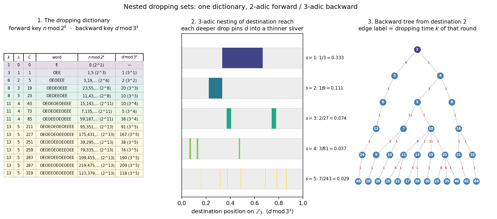
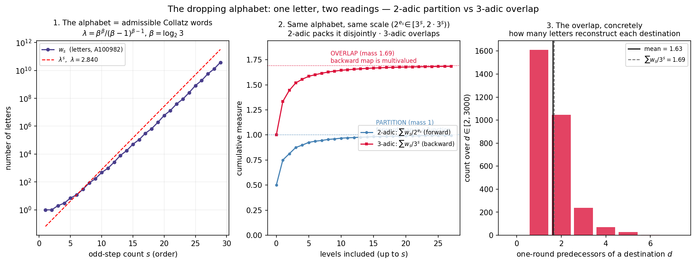
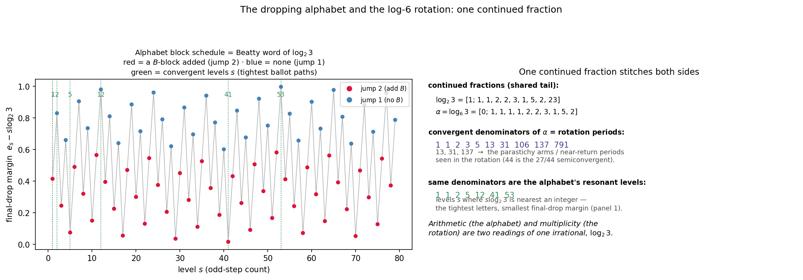
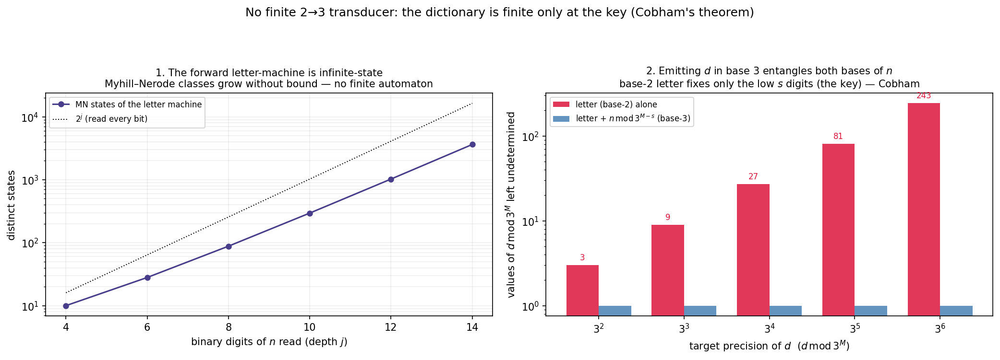

# Nested Dropping Sets

**Question:** [[Dropping Set|Dropping sets]] overlap, and you can apparently work *backwards* — reconstruct a dropping set from its destination. Are the rules for doing so a "dictionary"? How do the sets nest?

**Answer:** Yes. The dropping map is *one finite dictionary read in two opposite directions*. Forward it is keyed 2-adically ($n \bmod 2^k$); backward it is keyed 3-adically ($d \bmod 3^s$). The nesting is the 3-adic part: each deeper drop pins its destinations into an exponentially thinner sliver of $\mathbb{Z}_3$. This is the [[Collatz Complementarity Principle|2-adic / 3-adic complementarity]] realized as the forward/backward asymmetry of a single map.

Script: `scripts/collatz_nested_dropping.py` → `data/collatz_nested_dropping.png`.

## The dictionary

A **word-class** is the set of $n$ sharing one parity word over the $k$ steps of a dropping round. By the [[Affine Orbit Structure]] theorem the odd-step count $s$ is constant within a populated $\text{D}_k$, so a word-class is pinned by a triple $(k, s, C)$ and carries one exact affine map

$$\mathrm{dest}(n) = \frac{3^s\, n + C}{2^{\,k-s}}, \qquad C \in \mathbb{Z}\ \text{(the integer +1 accumulation)}.$$

The **dictionary** is the table of these triples. Up to $k=13$ there are 15 of them:

| $s$ | $k$ | words | forward key $n \bmod 2^k$ | backward key $d \bmod 3^s$ |
|---:|---:|---:|---|---|
| 0 | 1 | `E` | $0 \ (2)$ | — (no constraint) |
| 1 | 3 | `OEE` | $1,5 \ (8)$ | $1 \ (3)$ |
| 2 | 6 | `OEOEEE` | $3,19,35,51 \ (64)$ | $2 \ (9)$ |
| 3 | 8 | 2 words | $\dots \ (256)$ | $10, 20 \ (27)$ |
| 4 | 11 | 3 words | $\dots \ (2048)$ | $5, 10, 38 \ (81)$ |
| 5 | 13 | 7 words | $\dots \ (8192)$ | $38,76,91,118,167,190,209 \ (243)$ |

## Two directions

**Forward (2-adic key).** The low bits $n \bmod 2^k$ pick the word; the word gives the destination. The image of a residue class $r + 2^k\mathbb{Z}$ is an arithmetic progression of step $3^s$ — i.e. a *single* residue class mod $3^s$ on the destination line. Pure 2-adic in, single 3-adic class out.

**Backward (3-adic key).** Invert the affine map: a destination value $d$ has a predecessor in word-class $(k,s,C)$ **iff**

$$2^{\,k-s}\, d \equiv C \pmod{3^s},$$

and when it does the predecessor is *unique*:

$$n = \frac{2^{\,k-s}\, d - C}{3^s}.$$

So $d \bmod 3^s$ decides which words could have produced $d$, and each compatible word hands back exactly one $n$. "Build a dropping set from its destination" is literally this lookup. (The congruence can fire for a word the orbit doesn't asymptotically follow at very small $d$; confirming $\mathrm{dropping\_time}(n)=k$ filters those — empirically 15/16 hits are genuine in the tested range.)

Same table, **2-adic key forward, 3-adic key backward**. That asymmetry *is* the complementarity: the forward map reads the additive 2-adic structure, the inverse reads the additive 3-adic structure, and neither metric sees the other's key (cf. [[Prime Dropping Residues]], [[Log-6 Rotation Duality]] finding 14).

## The nesting (3-adic worm's-eye view)

Forward, each word-class maps its whole $2^k$-residue class onto one residue mod $3^s$. As $s$ climbs, the destinations a depth-$s$ drop can reach are pinned into an exponentially thinner 3-adic sliver. Measured fraction of residues mod $3^s$ covered (empirically confirmed against orbits, $n \le 3000$):

| $s$ | reachable $d \bmod 3^s$ | coverage $= \#\text{words}/3^s$ |
|---:|---|---:|
| 1 | $\{1\} \pmod 3$ | $1/3 = 0.333$ |
| 2 | $\{2\} \pmod 9$ | $1/9 = 0.111$ |
| 3 | $\{10,20\} \pmod{27}$ | $2/27 = 0.074$ |
| 4 | $\{5,10,38\} \pmod{81}$ | $3/81 = 0.037$ |
| 5 | $\{38,76,91,118,167,190,209\} \pmod{243}$ | $7/243 = 0.029$ |

The numerators $1,1,2,3,7$ are the inner-modulus counts of $\text{D}_k$ (the number of distinct parity words / [[Dropping Modulus|dropping moduli]] at each rung). The dropping sets **nest** 3-adically by destination reach — a Cantor-like family of shrinking slivers — while the only set with no 3-adic constraint is $\text{D}_1$ (the pure halving $n = 2d$, $s=0$), which can land anywhere.

## The overlap

A single destination is reachable from several levels at once — one predecessor per compatible word:

```
d= 1  <-  2 (k=1)
d= 2  <-  3 (k=6),  4 (k=1)
d= 4  <-  5 (k=3),  8 (k=1)
d= 5  <-  7 (k=11), 10 (k=1)
d=10  <- 11 (k=8), 13 (k=3), 15 (k=11), 20 (k=1)
d=16  <- 21 (k=3), 32 (k=1)
```

So $\text{D}_1, \text{D}_3, \text{D}_8, \text{D}_{11}$ all "meet" at destination 10. Iterating the backward lookup grows the inverse Collatz tree — but now factored cleanly into single dropping rounds, each edge a dictionary entry. The third panel of the figure draws this tree rooted at $d=2$.

---

# What the alphabet is

The natural next question — how the two dictionaries *relate*, and whether the alphabet has a construction from first principles — has a clean answer. Script: `scripts/collatz_dropping_alphabet.py` → `data/collatz_dropping_alphabet.png`.

## A letter is a ballot path (only 2 and 3, no chosen prime)

Strip a letter to its parity word. It is admissible as a dropping word **iff**

1. it starts with `O` (the seed is odd),
2. it has **no two adjacent `O`s** (because $3n+1$ is always even — every odd step forces a following halving), and
3. it is **ballot-admissible**: $3^{o} > 2^{e}$ at every interior prefix ($o,e$ = odd/even steps so far), with the *first* drop $3^{o} < 2^{e}$ occurring only at the final step.

The whole alphabet is generated by this rule, and the only arithmetic input is the comparison $3^{o} \gtrless 2^{e}$ — **no prime is privileged.** Arithmetic (the 2) and multiplicity (the 3) are two *readings* of one lattice path. The number of letters with $s$ odd steps is

$$w_s = 1,\,1,\,1,\,2,\,3,\,7,\,12,\,30,\,85,\,173,\,476,\,961,\,2652,\,8045,\,\dots$$

This is **[OEIS A100982](https://oeis.org/A100982)** — the *admissible Collatz sequences* of the stopping-time literature (Wagon 1985, Terras, Chamberland, Winkler, Roosendaal). A level-$s$ letter has length $k_s = \lceil s\log_2 6\rceil$ = A020914($s$). So the "dropping dictionary alphabet" we reached by working backwards is a classical, well-studied object — what is new here is reading it through the forward/backward (2-adic/3-adic) lens.

## Growth rate

$$\lambda = \lim_s w_s^{1/s} = \frac{\beta^\beta}{(\beta-1)^{\beta-1}}, \qquad \beta = \log_2 3 \approx 1.585, \qquad \lambda \approx 2.8395.$$

This is the binomial entropy of choosing $s$ odd steps among $e_s = \lceil s\log_2 3\rceil$ even slots; the ballot (positivity) constraint costs only a polynomial factor (verified: large-$s$ fits converge up to $\lambda$). Then $\log_3 \lambda \approx 0.950$ and $\log_6 \lambda \approx 0.560$.

## One letter, two readings — at the *same* scale

Each letter of level $s$ carries two keys, and because $e_s = \lceil s\log_2 3\rceil$ forces $2^{e_s} \in [3^s,\,2\cdot 3^s)$, the two keys resolve at the **same scale** $\approx 3^s$:

| | key modulus | total mass $\sum_s$ | what it means |
|---|---|---:|---|
| **Forward** (2-adic) | $n \bmod 2^{e_s}$ | $\sum w_s/2^{e_s} = \mathbf{1.000000}$ | **partition** of $\mathbb{Z}_2$ — the forward map is a *function*; every integer has exactly one dropping word |
| **Backward** (3-adic) | $d \bmod 3^s$ | $\sum w_s/3^s = \mathbf{1.690}$ | **overlapping** cover of $\mathbb{Z}_3$ — the backward map is *multivalued*; a typical destination has $\approx 1.69$ one-round predecessors |

The two identities are exact (the $1.000000$ is measured; it *is* the statement "almost every integer drops"). So the same alphabet, at the same resolution, is a **partition** under the 2-adic reading and a **1.69-fold overlap** under the 3-adic reading. The asymmetry is precisely *function vs multivalued*: forward each $n$ has one image (disjoint preimages → partition), backward each $d$ has many sources (overlapping images → redundant cover). The excess mass $1.69 - 1 = 0.69$ over the trivial halving $n = 2d$ **is** the overlap of dropping orbits — quantified. The predecessor-multiplicity histogram (figure panel 3) has exactly this mean.

This is the unifying statement between arithmetic and multiplicity: they are the **two readings of a single ballot alphabet**, equal in scale, differing only in that one direction of the map is single-valued and the other is not.

## The alphabet and the rotation are one continued fraction

The letters are blocks: $A = \texttt{OE}$ (altitude step $\log_2 3 - 1 \approx +0.585$) and $B = \texttt{E}$ (step $-1$). A level-$s$ letter is a ballot path of $s$ $A$-blocks and $e_s - s$ $B$-blocks. Climbing one level adds **one $A$-block and either 0 or 1 $B$-block**, and that 0/1 schedule — equivalently the increments $e_{s+1}-e_s \in \{1,2\}$ — is *exactly the Beatty / Sturmian word of $\log_2 3$*:

$$e_{s+1}-e_s = \lfloor (s{+}1)\log_2 3\rfloor - \lfloor s\log_2 3\rfloor = 2,1,2,1,2,2,1,2,1,2,2,1,\dots$$

And $\log_2 3$ is the very irrational that drives the [[Log-6 Rotation Duality|log-6 rotation]]: with $\alpha = \log_6 3 = \log_2 3/(1+\log_2 3)$, the two share a continued-fraction tail, so the **convergent denominators of $\alpha$**,

$$1,1,2,3,5,\;\mathbf{13},\,\mathbf{31},\,106,\,\mathbf{137},\,791,\dots$$

are simultaneously (i) the rotation's near-return periods — the $13/31/137$ parastichy arms, with $44$ the $27/44$ semiconvergent — *and* the resonant levels of the alphabet (the convergent denominators of $\log_2 3$ are $1,2,5,12,41,53,\dots$, the levels $s$ where $s\log_2 3$ is nearest an integer, i.e. the *tightest* letters whose leading word $(\texttt{OE})^s\texttt{E}^{\,k-2s}$ lands its final drop with the smallest altitude margin).

So the combinatorial alphabet (arithmetic) and the harmonic rotation (multiplicity) are **two faces of one number**, $\log_2 3$. The continued fraction that sets the rotation's quasi-period also schedules the growth of the dropping alphabet. Script: `scripts/collatz_alphabet_rotation.py` → `data/collatz_alphabet_rotation.png`.

## Is the dictionary a finite 2→3 transducer? No — and Cobham says why

If the forward $n\bmod 2^{e_s} \to$ backward $d\bmod 3^s$ correspondence were a single finite-state machine reading $n$ in base 2 and writing $d$ in base 3, we would have an explicit "Rosetta" device converting arithmetic into multiplicity. It does not exist, for a precise reason. Script: `scripts/collatz_dropping_transducer.py` → `data/collatz_dropping_transducer.png`.

**The forward letter-machine is infinite-state.** Reading $n$ LSB-first under the shortened map $T$, the $j$-th parity is $\texttt{bit} \oplus \texttt{carry}$ — but the carry is the *low-bit trajectory* $T^j(\text{low bits})$, an unbounded register. The Myhill–Nerode classes of $n\bmod 2^j \to$ (parity prefix) grow $10, 28, 88, 295, 1024, 3626,\dots$ without bound. No finite automaton assigns the letter (consistent with the parity-vector map not being $k$-automatic).

**Emitting $d$ in base 3 entangles both bases of $n$.** Exactly — and verified with zero violations over $6\times10^4$ samples:

$$d \bmod 3^M \ \text{is determined by}\ \big(\,\text{letter}(n),\ n \bmod 3^{M-s}\,\big),$$

where $\text{letter}(n)$ needs $e_s = \lceil s\log_2 3\rceil$ **base-2** digits of $n$ and the remaining $M-s$ ternary digits need $n \bmod 3^{M-s}$, i.e. **base-3** digits of $n$. The letter alone leaves $d\bmod 3^M$ spread over up to $3^{M-s}$ values ($3,9,27,81,243$ for $M-s=1,\dots,5$). So $d$'s ternary expansion has a **seam at digit $s$**: the low $s$ digits — the dictionary key — are supplied by reading $n$ in base 2; every digit above is supplied by reading $n$ in base 3.

A finite base-2→base-3 transducer cannot straddle that seam: it would make the dropping relation automatic in two multiplicatively independent bases, and by **Cobham's theorem (1969)** the only such relations are ultimately periodic (Presburger-definable). The dropping map — infinitely many affine pieces with non-periodic breakpoints (the [[#The alphabet and the rotation are one continued fraction|Beatty schedule]]) — is not. Hence no finite 2→3 machine.

**The positive residue.** The dictionary survives because it only ever matches the *key*: the low $s$ ternary digits of $d$, which the base-2 letter does determine — a finite correspondence at exactly the granularity Cobham permits. Push past the key and you must read $n$ in the other base. **Arithmetic (base 2) and multiplicity (base 3) meet precisely at the letter and, by Cobham, nowhere further** — the same wall as the irrationality of the rotation, now as a theorem.

## Significance

- **It makes the inverse map constructive.** Convergence questions are usually phrased forward (does every $n$ fall?). The dictionary gives the backward map in closed form: every value's one-round predecessors are a finite 3-adic lookup. The full predecessor tree of $1$ is generated by composing dictionary entries — a substitution system whose alphabet is $(k,s,C)$.
- **It localizes where the metrics talk.** Forward dynamics live on $\mathbb{Z}_2$ (which word), backward dynamics on $\mathbb{Z}_3$ (which destinations). The bridge is the single archimedean fact $\mathrm{dest} < n$ (the contraction $3^s/2^{k-s} < 1$, i.e. $k > s\log_2 6$). The 2-adic and 3-adic structures are otherwise independent — exactly the wall identified in [[Log-6 Rotation Duality]] (the round-to-round scattering law is archimedean, not algebraic).
- **The nesting is genuine self-similarity.** Per-level coverage $w_s/3^s \sim (\lambda/3)^s = 0.947^s \to 0$ with $\lambda \approx 2.84 < 3$, so the reachable-destination set is a 3-adic Cantor dust of box dimension $\log_3 \lambda \approx 0.950 < 1$ — the 3-adic shadow of the [[Log-6 Rotation Duality|quasicrystal]] picture. The 2-adic reading, by contrast, is a full-measure partition (dimension 1).
- **The alphabet is classical; the framing is new.** The letters are exactly the admissible Collatz sequences ([OEIS A100982](https://oeis.org/A100982); Wagon, Terras, Chamberland, Winkler). What this exploration adds is (i) the explicit *backward* 3-adic reconstruction $n = (2^{k-s}d - C)/3^s$, and (ii) the partition-vs-overlap duality that makes "arithmetic vs multiplicity" a single measured statement.
- **The wall is Cobham's theorem.** The reason no single finite machine unifies the two readings is not vague "complexity" but a named obstruction: 2 and 3 are multiplicatively independent, so by Cobham (1969) nothing non-trivial is automatic in both bases. The dictionary is finite exactly at the letter (the key) and Cobham forbids extending it. This is the algebraic counterpart of the archimedean wall above — the same boundary seen 2-/3-adically rather than at $\infty$.

## Figures

-  — the dictionary read two ways; 3-adic nesting; backward tree.
-  — alphabet growth ($\lambda$); 2-adic partition vs 3-adic overlap; predecessor multiplicity.
-  — block schedule = Beatty word of $\log_2 3$; shared continued fraction with the rotation ($13/31/137$).
-  — letter-machine is infinite-state; emitting $d$ in base 3 needs both bases of $n$ (Cobham).

## Related

[[Affine Orbit Structure]] (forward map, proved), [[Collatz Complementarity Principle]], [[Log-6 Rotation Duality]], [[Prime Dropping Residues]], [[Dropping Zeta Spectrum]], [[Orbital Oddity Conjecture]].
