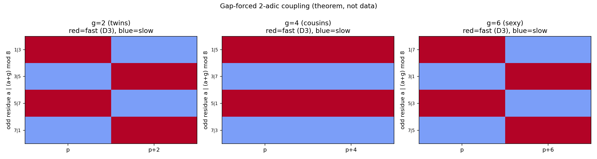
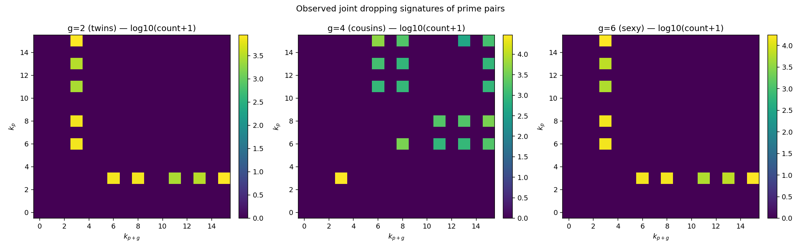
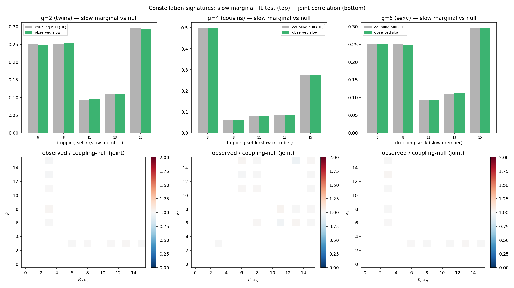
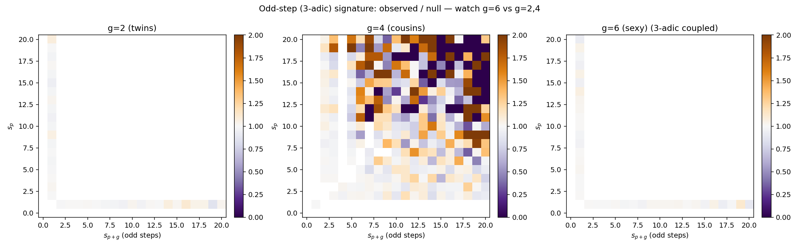

# Prime Constellation Signatures

**Question:** Do prime constellations — twins $(p,p{+}2)$, cousins $(p,p{+}4)$,
sexy $(p,p{+}6)$ — distribute across Collatz dropping signatures in a way the
gap-forced coupling and Hardy–Littlewood cannot explain?

**Method:** see [Spec](../superpowers/specs/2026-06-14-prime-constellation-signatures-design.md)
and [Plan](../superpowers/plans/2026-06-14-prime-constellation-signatures.md).
Each pair gets a joint signature $(k_p, k_{p+g})$ via `collatz.constellations`.
We compare the observed pairs to an **admissible-integer coupling null** (the
distribution over all odd integers $n$ with $n+g$ odd — exactly the integers
admissible for the constellation at the prime 2), measuring both the joint
distribution (total-variation distance) and the slow-member marginal ($\chi^2$).
The odd-step count $s$ = `orbital_oddity` gives a 3-adic layer, where $g=6$ is a
built-in cross-check ($6 = 2\cdot3$ couples the members mod 3).

**The forced coupling (theorem):** every twin/sexy pair is one fast dropper
($\equiv 1\bmod4$, dropping set 3) and one slow member; every cousin pair shares
its mod-4 class. This is the spine of all four figures.

**A note on the baseline.** An earlier framing compared the slow member to *all*
generic primes. That is misleading: ~half of all primes are $\equiv 1\bmod4$ and
hence in dropping set 3, while a twin's slow member is *never* set 3 by
construction — so the comparison just re-measures the forced mod-4 split (it gave
a meaningless $\chi^2 \approx 2155$). The honest baseline is the coupling null's
*own* slow marginal (admissible $3\bmod4$ integers), which Hardy–Littlewood says
the slow primes should inherit. With that correction every comparison is
observed-pairs vs the coupling null.

**Results at $N = 10^7$ ($\pi(N) = 664{,}579$):**

| gap | pairs | $\chi^2$ (slow vs null-slow) | TV (joint vs null) |
|-----|-------|------------------------------|--------------------|
| 2 (twins)   | 58{,}980  | 3.5 | 0.0039 |
| 4 (cousins) | 58{,}622  | 1.3 | 0.0038 |
| 6 (sexy)    | 117{,}207 | 3.8 | 0.0023 |

Top deviating joint cells (observed density − null density), all tiny:

- **twins:** $(8,3)\,{+}0.0024$, $(15,3)\,{-}0.0017$, $(3,6)\,{-}0.0008$
- **cousins:** $(3,3)\,{-}0.0017$, $(15,6)\,{+}0.0014$, $(8,11)\,{+}0.0009$
- **sexy:** $(13,3)\,{+}0.0009$, $(15,3)\,{-}0.0007$, $(3,13)\,{+}0.0007$

**Figures:**

- 
- 
- 
- 

**Interpretation — no signal beyond the null.** Once the baseline is the
coupling null rather than all primes, the slow-member marginal is statistically
indistinguishable from the Hardy–Littlewood prediction ($\chi^2$ of 1–4 across
$\sim 2^{k}$ buckets is noise-level), and the joint distribution sits on top of
the null to within total-variation $\sim 0.002$–$0.004$. The largest per-cell
deviations are $\lesssim 0.0024$ in density — finite-$N$ shot noise, not
structure. The $g=6$ odd-step cross-check (genus figure) shows the same
agreement: the 3-adic factor changes the *density* of sexy primes but not the
*shape* of their dropping-signature distribution relative to admissible
integers. **Collatz organizes prime constellations exactly as the singular
series predicts, and no more** — a clean negative result. The forced 2-adic
coupling (fast/slow for twins and sexy, same-class for cousins) is the only
structure, and it is a theorem, not an empirical surprise.

**Caveats.** Two simplifications, neither affecting the conclusion: (1) unlike
the sibling [[Prime Dropping Residues]] sweep, this study does *not* separate
out small members $p < 2^{k(p)}$ — observed pairs and the null bin all integers
identically, so the comparison stays apples-to-apples and the few hundred such
pairs below $10^7$ cannot manufacture signal. (2) For cousins ($g=4$) a pair can
be *both*-slow, so "slow member" is taken as the larger $k$ coordinate; the
$g=4$ $\chi^2$ therefore measures a slightly different object than the
unambiguous fast/slow split of twins and sexy primes.

**Open (Phase D, if revisited):** lift the null to the combined $2^{k-2s}6^s$
modulus and re-test for residual 3-adic signal; run the spectral/diffraction
layer on the ordered pair-fingerprint sequence (looking for constellation-
specific Bragg peaks); extend $g$ beyond 6 to confirm the TV stays at noise
level as the singular series varies. See [[Collatz as a Quasicrystal]],
[[Prime Dropping Residues]], [[Dropping Zeta Spectrum]].

**Related:** [[Prime Dropping Residues]], [[Kozyrev Orbital Spectrum]], [[Collatz Embeddings]].
