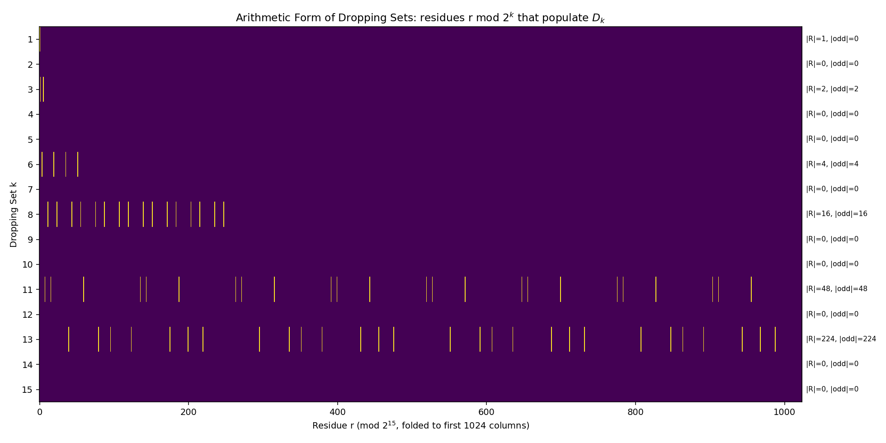
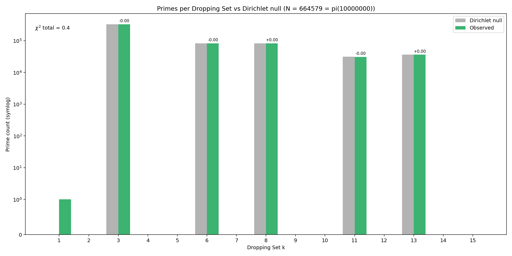
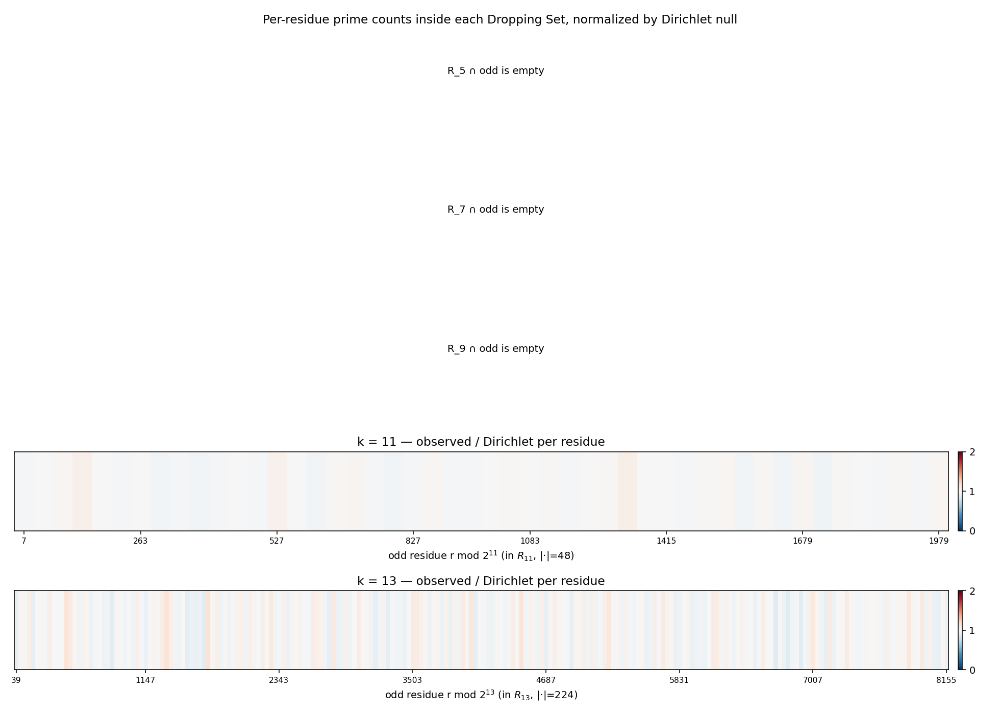

# Prime Dropping Residues

**Question:** Do primes distribute across [[Dropping Sets]] in a way that the Dirichlet null (equidistribution across odd residues mod $2^k$) cannot explain?

**Method:** see [Spec](../superpowers/specs/2026-06-02-prime-dropping-residues-design.md) and [Plan](../superpowers/plans/2026-06-02-prime-dropping-residues.md). Briefly: write each $D_k$ as $\bigcup_{r \in R_k} (r + 2^k \mathbb{Z})$ via `collatz.residues.dropping_set_residues`, sieve primes up to $N = 10^7$, classify, compare to Dirichlet.

## Result at $N = 10^7$, $K_{\max} = 15$

**Summary table** (from `scripts/prime_dropping_residues.py`):

| $k$ | $\|R_k\|$ | $\|R_k \cap \text{odd}\|$ | predicted | observed | $\log_{10}(\text{obs}/\text{pred})$ | $\chi^2$ |
|---:|---:|---:|---:|---:|---:|---:|
| 1  | 1   | 0   | 0        | 1        | —        | 0.0 |
| 2  | 0   | 0   | 0        | 0        | —        | 0.0 |
| 3  | 2   | 2   | 332289.5 | 332180   | $-0.000$ | 0.0 |
| 4  | 0   | 0   | 0        | 0        | —        | 0.0 |
| 5  | 0   | 0   | 0        | 0        | —        | 0.0 |
| 6  | 4   | 4   | 83072.4  | 83039    | $-0.000$ | 0.0 |
| 7  | 0   | 0   | 0        | 0        | —        | 0.0 |
| 8  | 16  | 16  | 83072.4  | 83216    | $+0.001$ | 0.2 |
| 9  | 0   | 0   | 0        | 0        | —        | 0.0 |
| 10 | 0   | 0   | 0        | 0        | —        | 0.0 |
| 11 | 48  | 48  | 31152.1  | 31111    | $-0.001$ | 0.1 |
| 12 | 0   | 0   | 0        | 0        | —        | 0.0 |
| 13 | 224 | 224 | 36344.2  | 36397    | $+0.001$ | 0.1 |
| 14 | 0   | 0   | 0        | 0        | —        | 0.0 |
| 15 | 0   | 0   | 0        | 0        | —        | 0.0 |

- Total primes $\le N$: **664,579** ($= \pi(10^7)$).
- $\chi^2$ total across all 15 bins: **$\approx 0.4$**.
- Small primes (those with $p < 2^{k(p)}$): 63,772 ($\sim 9.6\%$); these are still in some residue class and not excluded.
- The lone "anomalous" count at $k=1$ — observed = 1, predicted = 0 — is the prime $p = 2$ itself; it is the unique even prime and sits in $D_1$ by virtue of being even.
- Populated dropping sets are exactly $k \in \{1, 3, 6, 8, 11, 13\}$ (the Beatty-rung pattern of the existing 2-adic skeleton). Every $|R_k|$ is built entirely of odd residues — i.e., once you exclude $D_1$, every member of every populated $D_k$ is coprime to $2^k$, so the Dirichlet count is exact rather than approximate.

## Interpretation

**The Dirichlet null fits.** Every populated $D_k$ has $\log_{10}(\text{observed}/\text{predicted}) \le 10^{-3}$ in absolute value, and $\chi^2$ contributions are all sub-unity. At $N = 10^7$, primes distribute across the Collatz dropping-set hierarchy precisely as Dirichlet's theorem predicts: equidistribution across the odd residues mod $2^k$ that comprise $R_k$.

There is **no measurable structural signal beyond the 2-adic arithmetic form**. The "interesting" structure visible at the per-$D_k$ level (some sets are prime-rich, some are prime-poor, some are empty) is entirely accounted for by the residue counts $|R_k \cap \text{odd}|$ — i.e., by the arithmetic of how many residue classes mod $2^k$ live in $D_k$, not by anything specific to *primes*.

This is informative in both directions:

- **Falsification side:** the speculation that "primes might cluster in certain dropping sets" is empirically false at $N = 10^7$. The clustering you see in the raw bar chart of primes-per-$D_k$ is the clustering of *integers* per $D_k$, scaled by $\pi(N)/N$.
- **Structural side:** the dropping-set decomposition is exactly the 2-adic structure of $\mathbb{Z}$, no more. Any Collatz-specific bias on primes must live at a finer level than 2-adic residue.

## Where signal could still hide

Three places this analysis would *miss* signal:

1. **The 3-adic refinement** (Phase D in the spec): the combined modulus $2^{k-2s} \cdot 6^s$ resolves finer than $2^k$. If Collatz biases primes via the 3-adic side, the 2-adic-only sieve here cannot see it.
2. **Cross-residue correlations**: this analysis treats each $D_k$ independently. A "shape" signal where primes prefer some residues in $D_3$ *given* their residue in $D_8$ would be invisible.
3. **Larger $k$**: $R_k$ for $k \in \{16, 18, 21, \dots\}$ (the next Beatty rungs) was not measured. Their cardinalities are large; per-residue prime counts would be small at $N = 10^7$ and a higher $N$ (or a more aggressive sieve) would be needed to test.

If a follow-up matters, Phase D (3-adic refinement) is the natural first move — it has prior code support in [[Dropping Zeta Spectrum]] and existing docs (`docs/00-Index.md`).

## Figures

- 
- 
- 

## Related explorations

[[Collatz Embeddings]], [[Kozyrev Orbital Spectrum]], [[Dropping Zeta Spectrum]], [[Machine Learning]].
